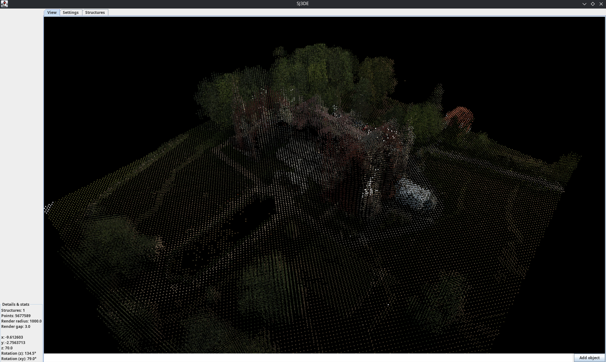
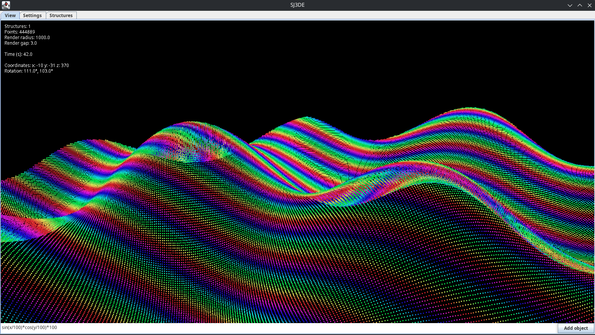

# SJ3DE
My first attempt using Java for 3D data visualization. **Goal is to build 3D visualization tool for LiDAR measurements.**

    
    
    

## Usage
#### How can I navigate?
Navigation: \
`Q` go up \
`E` go down \
`W/A/S/D` classical navigation \
_To rotate camera, use right mouse button. To use tool from toolbox, use left button._

Options: \
`F1` debugging \
`F2` toolbox
 

#### How can I modify observed objects?
To modify/add/remove new objects (including importing .LAZ files) go to the `Structures` tab.
Moreover, you can add new simple `Space` structures defined by mathematical expressions using 
text panel on the bottom of the `View` tab.

## Screenshots
Moszna Palace (46.5 MB .laz file)

Mathematical expression

## Credits
SJ3DE uses external libraries:
* `exp4j` by [objecthunter](https://www.objecthunter.net/exp4j/team-list.html),
* `laszip4j` by [Marcel Reutegger](https://github.com/mreutegg).

